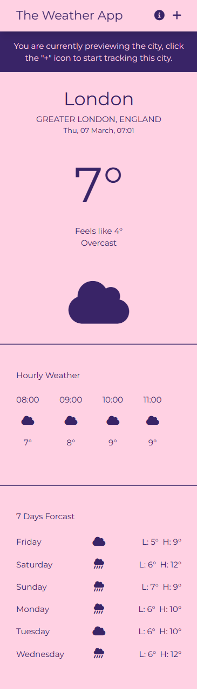

# Weather App
Site is live at: https://fancifulcrow.github.io/weather-app/  

This is a simple weather app built with Vue 3 and Tailwind CSS. It allows users to check the current weather conditions of a location by entering the city name. 

## Project Setup

```sh
npm install
```

### Compile and Hot-Reload for Development

```sh
npm run dev
```

### Compile and Minify for Production

```sh
npm run build
```

### Lint with [ESLint](https://eslint.org/)

```sh
npm run lint
```

## Screenshot
<p align="center">
  
</p>

## Technologies Used
- Vue 3
- Tailwind CSS

## Credits
- Weather data provided by [Open-Meteo](https://open-meteo.com/) Weather API.
